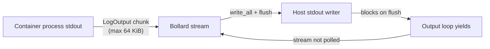
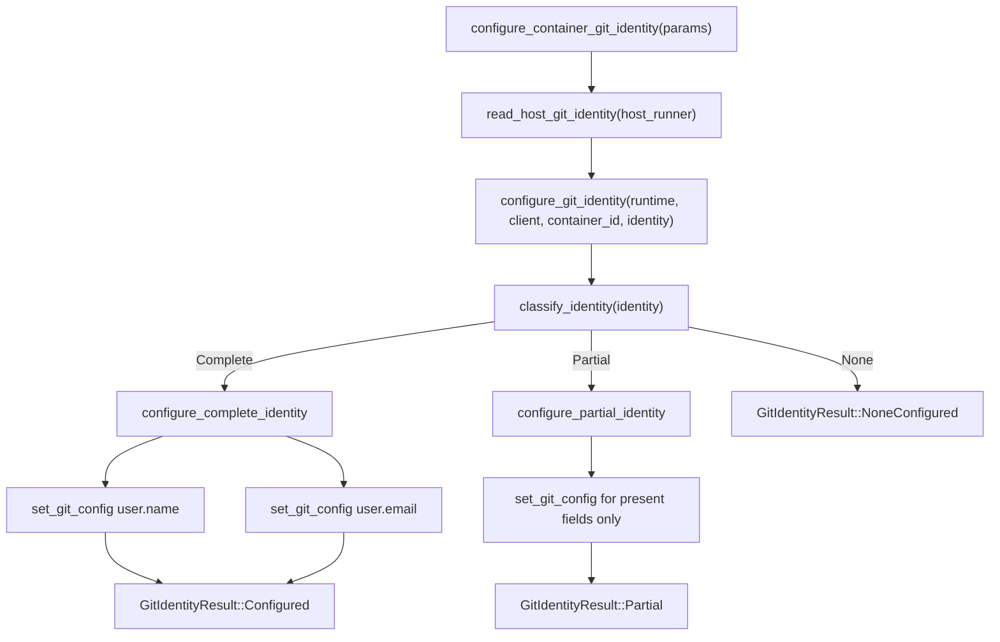

# Developer's guide

This guide is for maintainers and contributors working on the Podbot codebase.
It covers build and test workflows, subsystem architecture, and the
implementation contracts that code changes must preserve. For design rationale,
constraints, and intended evolution, see [podbot-design.md](podbot-design.md).
For user-facing behaviour and configuration reference, see
[users-guide.md](users-guide.md).

## 1. Normative references

- [AGENTS.md](../AGENTS.md): commit gating, code style, and Rust-specific
  guidance.
- [documentation-style-guide.md](documentation-style-guide.md): spelling,
  formatting, and document type conventions.
- [podbot-design.md](podbot-design.md): architecture, security model,
  error handling, and design rationale.

## 2. Build, test, and lint

All quality gates must pass before committing. The canonical targets are:

| Target              | Command                                                                | Purpose                       |
| ------------------- | ---------------------------------------------------------------------- | ----------------------------- |
| `make check-fmt`    | `cargo fmt --workspace -- --check`                                     | Verify formatting             |
| `make fmt`          | `cargo fmt --workspace`                                                | Apply formatting fixes        |
| `make lint`         | `cargo clippy --workspace --all-targets --all-features -- -D warnings` | Lint with all warnings denied |
| `make test`         | `cargo test --workspace`                                               | Run full test suite           |
| `make markdownlint` | markdownlint-cli                                                       | Validate Markdown files       |
| `make nixie`        | Mermaid diagram validator                                              | Validate diagrams in Markdown |

Run long commands through `tee` and `set -o pipefail` so truncated output can
be reviewed from the log file.

## 3. Repository layout (exec subsystem)

The exec subsystem lives under `src/engine/connection/exec/` and implements
container command execution across three modes.

```plaintext
src/engine/connection/exec/
+-- mod.rs               # Dispatch, ExecRequest/ExecResult types,
|                        #   ContainerExecClient trait, ExecMode enum,
|                        #   PROTOCOL_OUTPUT_CAPACITY constant
+-- protocol.rs          # Protocol proxy loops, stdin forwarding,
|                        #   Stdout Purity Contract, STDIN_BUFFER_CAPACITY,
|                        #   STDIN_SETTLE_TIMEOUT, ProtocolProxyIo
+-- attached.rs          # Attached-mode session, terminal resize,
|                        #   SIGWINCH handling, stdin echo forwarding
+-- terminal.rs          # Terminal size detection (stty), resize helpers,
|                        #   TerminalSizeProvider trait
+-- tests.rs             # Test module root
+-- tests/
    +-- protocol_proxy_bdd.rs         # BDD Gherkin scenarios
    +-- proxy_helpers/
    |   +-- mod.rs                    # Test helper root
    |   +-- lifecycle_purity.rs       # Stdout purity regression tests
    |   +-- forwarding.rs            # stdin/stdout forwarding tests
    |   +-- routing.rs               # Output routing (StdOut/StdErr/StdIn)
    |   +-- error_mapping.rs         # Error propagation tests
    |   +-- validation_tests.rs      # Request validation tests
    +-- detached_helpers.rs          # Detached mode test helpers
    +-- lifecycle_helpers.rs         # Shared lifecycle fixtures
    +-- protocol_helpers.rs          # Protocol-specific test helpers
```

### 3.1. Execution modes

| Mode     | Enum variant         | TTY         | Streams   | Resize | Use case                                          |
| -------- | -------------------- | ----------- | --------- | ------ | ------------------------------------------------- |
| Attached | `ExecMode::Attached` | Conditional | Forwarded | Yes    | Interactive terminal sessions (`podbot exec`)     |
| Detached | `ExecMode::Detached` | No          | None      | No     | Fire-and-forget commands (`podbot exec --detach`) |
| Protocol | `ExecMode::Protocol` | No          | Forwarded | No     | Byte-preserving proxy (`podbot host`)             |

_Table 1: Execution modes and their behavioural properties._

Attached mode enables TTY only when both local stdin and stdout are terminals.
Protocol mode permanently disables TTY, so the byte stream is not corrupted by
terminal framing.

### 3.2. Key types

- **`ExecRequest`**: validated parameters for an exec session (container
  identifier (ID), command, environment, mode, TTY flag).
- **`ExecResult`**: outcome carrying the daemon-assigned exec ID and exit
  code.
- **`ContainerExecClient`**: trait abstracting Bollard exec Application
  Programming Interface (API) calls for unit testability.
- **`ProtocolProxyIo<HostStdin, HostStdout, HostStderr>`**: generic
  host-IO bundle injected into the protocol proxy for testing.

## 4. Stdout purity contract

The protocol proxy must never write bytes to host stdout that did not originate
from container stdout or console output. The authoritative definition lives in
the module-level doc comment of `src/engine/connection/exec/protocol.rs`.

The contract requires:

- No banners, progress indicators, or status messages on stdout.
- No diagnostic output or error messages on stdout (route to stderr).
- No echoed stdin bytes (`LogOutput::StdIn` is silently dropped).
- No framing, escaping, or encoding of the byte stream.

### 4.1. Enforcement by construction

The function `run_protocol_session_with_io_async` accepts injected host-IO
handles via `ProtocolProxyIo` and only writes to host stdout in
`handle_log_output_chunk` for `LogOutput::StdOut` and `LogOutput::Console`
messages. All other code paths route to stderr or return errors without
touching stdout.

### 4.2. Enforcement by test

The `tests/proxy_helpers/lifecycle_purity.rs` module contains regression tests
covering:

- Startup purity (no bytes before proxied data).
- Steady-state purity with mixed stream types.
- Shutdown purity (no bytes after proxied data).
- Error-path purity (no stdout contamination on daemon stream failure).
- Stdin echo suppression (`LogOutput::StdIn` records are not forwarded).
- Zero stdout bytes when the daemon produces no stdout output.

These tests use `RecordingWriter` test doubles to capture bytes written to each
stream and assert that only expected content appears on stdout.

### 4.3. Contrast with attached mode

Attached mode intentionally echoes `LogOutput::StdIn` records to stdout for
interactive terminal feedback. Protocol mode must not do this because
stdio-framed servers would misinterpret echoed input bytes as protocol output.

## 5. Bounded buffering

Protocol-mode exec sessions use explicitly bounded buffers so backpressure
remains visible to the hosted server. All buffer sizes are set to 64 KiB
(65,536 bytes).

### 5.1. Constants

| Constant                   | Location      | Value    | Purpose                                                   |
| -------------------------- | ------------- | -------- | --------------------------------------------------------- |
| `STDIN_BUFFER_CAPACITY`    | `protocol.rs` | 65,536 B | `BufReader` capacity for host stdin reads                 |
| `PROTOCOL_OUTPUT_CAPACITY` | `mod.rs`      | 65,536 B | Bollard `output_capacity` per `LogOutput` chunk           |
| `STDIN_SETTLE_TIMEOUT`     | `protocol.rs` | 50 ms    | Grace period before aborting stdin forwarding at shutdown |

_Table 2: Bounded buffering constants for protocol-mode exec sessions._

The 64 KiB size aligns with common JSON Remote Procedure Call (JSON-RPC) frame
buffers and typical operating system (OS) pipe buffer defaults.

### 5.2. Stdin forwarding path

Host stdin is wrapped in a `BufReader` with `STDIN_BUFFER_CAPACITY` before
being copied to the container stdin writer via `tokio::io::copy`. This bounds
the maximum memory consumed per read cycle and provides backpressure by
limiting how many bytes can be in flight between host stdin reads and container
input writes.

The container stdin writer receives unbuffered writes from the copy operation.
Each write is followed by an explicit flush on the container input stream after
the copy completes, plus a shutdown call to signal end-of-input.

### 5.3. Output forwarding path

Bollard's `output_capacity` is set to `PROTOCOL_OUTPUT_CAPACITY` for
protocol-mode sessions via `build_start_exec_options`. This controls the
maximum bytes per `LogOutput` chunk delivered by the daemon, reducing per-chunk
overhead for large protocol messages.

Each output chunk is forwarded with `write_all()` followed by `flush()`. If the
host stdout writer blocks on flush, the output loop yields, the Bollard stream
stops being polled, and backpressure propagates to the container.

Non-protocol modes (attached and detached) leave `output_capacity` as `None`,
using Bollard's default 8 KiB chunk size.

### 5.4. Backpressure chain

For screen readers: The following diagram shows how backpressure propagates
from the host stdout consumer back to the container process.



_Figure 1: Backpressure propagation from host stdout to container._

## 6. Stdin forwarding lifecycle

Protocol-mode stdin forwarding runs as a spawned Tokio task
(`spawn_stdin_forwarding_task`). The lifecycle is:

1. Task reads from host stdin via `BufReader` and copies to container
   input.
2. On host stdin end-of-file (EOF), the copy completes, the task
   flushes and shuts down the container input writer.
3. If the container output stream completes while host stdin is still
   open, the output loop finishes first.
4. `settle_stdin_forwarding_task` waits up to `STDIN_SETTLE_TIMEOUT`
   (50 ms) for the stdin task to complete.
5. If the timeout expires, the task is aborted via
   `abort_stdin_forwarding_task` and an `ExecFailed` error is returned.
6. If the task completes within the timeout, its result is classified:
   `Ok(Ok(()))` is success, `Ok(Err(_))` is an IO forwarding failure, and
   `Err(cancelled)` is treated as success (expected during abort).

## 7. Adding a new exec mode

When adding a new execution mode:

1. Add the variant to `ExecMode` in `mod.rs`.
2. Update `is_attached()` and `is_protocol()` predicates as needed.
3. Add a match arm in `exec_async_with_terminal_size_provider`.
4. Decide whether `build_start_exec_options` should set
   `output_capacity` for the new mode.
5. Add tests covering the new mode's stream routing, buffering, and
   TTY behaviour.
6. Update `podbot-design.md` and this guide.

## 8. Testing conventions

### 8.1. Test organization

- Unit tests live in `tests.rs` submodules colocated with production
  code.
- Behaviour-Driven Development (BDD) scenarios use Gherkin-style naming
  in `protocol_proxy_bdd.rs`.
- Shared fixtures and helpers are grouped under `tests/proxy_helpers/`.

### 8.2. Test doubles

- `RecordingWriter`: captures bytes written to a stream for assertion.
- `ProtocolProxyIo::new(stdin, stdout, stderr)`: injects host-IO
  handles so tests can supply in-memory readers and writers.
- `run_lifecycle_session(runtime, stdin_bytes, output)`: convenience
  wrapper around `run_session` for lifecycle purity tests that only
  need to inspect stdout. It creates `RecordingWriter` handles
  internally and returns `(Result<(), PodbotError>,
  Arc<Mutex<Vec<u8>>>)` — the session result paired with captured
  stdout bytes.
- `ContainerExecClient` mock implementations for unit testing without a
  live daemon.

### 8.3. Parameterized tests

Use `#[rstest(...)]` to eliminate duplicated test cases. Group related
parameters in structs when the parameter list exceeds three items. For
example:

```rust
#[rstest]
#[case(401, "Bad credentials", &["credentials rejected", "regenerate"])]
#[case(403, "Forbidden", &["insufficient permissions", "settings"])]
fn classify_error_messages(
    #[case] status: u16,
    #[case] message: &str,
    #[case] expected_substrings: &[&str],
) {
    let msg = classify_by_status(status, message);
    for expected in expected_substrings {
        assert!(msg.contains(expected), "expected '{expected}' in: {msg}");
    }
}
```

This reduces duplication whilst preserving independent test case execution and
clear failure diagnostics.

## 9. Error handling boundary

The exec subsystem maps failures to `PodbotError` via the `exec_failed` helper,
which produces `ContainerError::ExecFailed { container_id, message }`. Callers
receive semantic errors they can inspect and handle. The CLI boundary converts
these to `eyre::Report` for operator-facing display.

See [podbot-design.md, Error handling](podbot-design.md#error-handling) for the
full error hierarchy.

## 10. GitHub error classification module

The GitHub App credential validation system uses a layered error classification
architecture to transform HTTP status codes and error messages into actionable
user-facing diagnostics.

### 10.1. Module structure

Error classification logic is separated into `src/github/classify.rs` to keep
the main `src/github/mod.rs` file under the 400-line budget. The classify
module provides:

- `classify_github_api_error(error: octocrab::Error) -> GitHubError` — entry
  point called by `OctocrabAppClient::validate_credentials` via `map_err`
- `classify_by_status(code: u16, full_error: &str) -> String` — maps HTTP
  status codes to error messages with remediation hints
- `is_rate_limited(message: &str) -> bool` — distinguishes rate-limit 403s
  from permission 403s using case-insensitive substring matching

### 10.2. Visibility and testing

The classification functions use Rust's visibility controls to maintain a clean
public API surface:

- `classify_github_api_error` is `pub(super)` — visible only within the
  `github` module
- `classify_by_status` is `pub(crate)` — visible within the podbot crate for
  unit tests but not part of the public library API
- `is_rate_limited` is private (`fn`) — implementation detail

Integration tests (in `tests/`) are outside the crate boundary and cannot
import `pub(crate)` items. The `test_classify_error_message` function in
`src/github/mod.rs` provides a `#[doc(hidden)]` public wrapper for BDD tests
that need to construct mock error messages matching production output.

### 10.3. Error message format

All classified error messages follow this template:

```plaintext
<classification> (HTTP <code>). Hint: <remediation guidance>. Raw error: <original octocrab error>
```

The raw error is always preserved to aid debugging. HTTP status codes map to
classifications as follows:

- **401** — credentials rejected
- **403** (rate limit) — rate limit exceeded
- **403** (permissions) — insufficient permissions
- **404** — App not found
- **500–599** — GitHub API unavailable
- **other** — unexpected response

### 10.4. Extending the classifier

To add a new HTTP status code classification:

1. Add a new match arm in `classify_by_status` in `src/github/classify.rs`.
2. Follow the existing message format with classification, hint, and raw error.
3. Add a parameterized test case to `classify_error_messages` in
   `src/github/credential_error_tests.rs`.
4. Add a BDD scenario to `tests/features/github_credential_errors.feature` if
   the classification affects user-visible orchestration behaviour.

### 10.5. Rate-limit detection

The `is_rate_limited` function uses ASCII case-insensitive byte comparison to
avoid allocating a lowercased string on the error path. It scans for the
substring "rate limit" using `as_bytes().windows().eq_ignore_ascii_case()`.
This is safe because GitHub's error messages are ASCII.

## 11. BDD testing patterns for credential validation

Credential validation scenarios use the rstest-bdd framework with a four-file
helper structure:

- `tests/bdd_github_credential_errors.rs` — scenario entry points
- `tests/bdd_github_credential_errors_helpers/mod.rs` — re-exports
- `tests/bdd_github_credential_errors_helpers/state.rs` — scenario state with
  `Slot`-based fields
- `tests/bdd_github_credential_errors_helpers/steps.rs` — Given and When step
  definitions
- `tests/bdd_github_credential_errors_helpers/assertions.rs` — Then step
  assertions

### 11.1. Mock client construction

BDD tests use `mockall::mock!` to define a local `MockGitHubAppClient` because
`#[cfg_attr(test, mockall::automock)]` on the trait is only available within
the main crate's test configuration. The `configure_mock_client` helper
constructs mock responses by calling `test_classify_error_message` to ensure
test expectations match production output exactly.

### 11.2. Step result pattern

All step functions return `StepResult<()>` (a type alias for
`Result<(), String>`) to satisfy clippy's `expect_used` lint. Use
`.ok_or_else(|| String::from("error message"))` instead of `.expect()` when
extracting `Slot` values from scenario state.

## 12. Dev-dependencies for test construction

The `Cargo.toml` `[dev-dependencies]` section includes:

- **snafu** — provides `Backtrace::generate()` for constructing
  `octocrab::Error::Service` variants in unit tests. This dependency is already
  in the transitive dependency graph via octocrab, so adding it as an explicit
  dev-dependency does not increase the total dependency count.

The unit tests do not directly import `http` types despite octocrab's use of
`http::StatusCode`, because the tests access status codes through octocrab's
public API rather than constructing HTTP responses directly.

## 13. Code style conventions

### 13.1. File length budgets

The codebase enforces a 400-line limit per file to maintain readability. When a
module approaches this budget:

1. Extract logically cohesive functions into a new submodule.
2. Use `mod submodule;` in the parent module.
3. Control visibility with `pub(super)`, `pub(crate)`, or `pub` as appropriate.
4. Update imports in calling code.

The GitHub module demonstrates this pattern: classification functions were
extracted from `src/github/mod.rs` into `src/github/classify.rs` when `mod.rs`
exceeded 400 lines.

### 13.2. Module-level documentation

All Rust modules must begin with `//!` doc comments describing the module's
purpose. This applies to:

- Source files in `src/`
- Test modules in `src/` (e.g., `credential_error_tests.rs`)
- Integration test harnesses in `tests/`
- Helper submodules under `tests/`

Module docs should be concise (2–4 lines) and focus on what the module does,
not how it works. Implementation details belong in function-level `///` docs.

### 13.3. Rustdoc and missing_docs compliance

The project uses `#![deny(missing_docs)]` at the crate level. All public items
require `///` rustdoc comments. Use `#[doc(hidden)]` for items that must be
public for technical reasons (such as cross-crate test helpers) but should not
appear in generated documentation.

### 13.4. Clippy pedantic and denied lints

The project enforces clippy pedantic mode with additional denied lints:

- `expect_used` — use `.ok_or_else()` or `?` instead
- `unwrap_used` — use `.ok_or_else()` or `?` instead
- `indexing_slicing` — use `.get()` with bounds checks
- `print_stdout` / `print_stderr` — use logging or dedicated output functions

When a lint cannot be satisfied due to API constraints, use `#[expect]` (not
`#[allow]`) with a clear reason:

```rust
#[expect(
    clippy::needless_pass_by_value,
    reason = "required by map_err signature; error is consumed to extract status"
)]
fn classify_github_api_error(error: octocrab::Error) -> GitHubError {
    // ...
}
```

### 13.5. En-GB-oxendict spelling

Documentation uses British English with Oxford spelling (`en-GB-oxendict`):

- Use `-ize` suffixes: contextualized, subclassification
- Use `-our` suffixes: behaviour, colour
- Use `-re` suffixes: centre, fibre
- Capitalize proper nouns: Markdown, GitHub, Rust

The words "outwith" and "caveat" are acceptable.

## 14. Git identity subsystem

The `git_identity` subsystem propagates host Git identity (`user.name` and
`user.email`) into a running container before repository operations need to
create commits. The implementation deliberately splits host inspection from
container mutation, so each side can be tested independently and reused by the
API orchestration layer.

This subsystem spans three internal layers:

- `src/engine/connection/git_identity/host_reader.rs` reads host Git config.
- `src/engine/connection/git_identity/container_configurator.rs` converts the
  host values into `git config --global` exec calls inside the container.
- `src/api/configure_git_identity.rs` provides the orchestration entry point
  that library callers use when they need podbot to apply the host identity to
  a specific container.

### 14.1. Module layout

```plaintext
src/api/
+-- configure_git_identity.rs    # API orchestration entry point and API params

src/engine/connection/git_identity/
+-- mod.rs                       # Re-exports and git_identity_exec_failed helper
+-- host_reader.rs               # HostCommandRunner, SystemCommandRunner,
|                                #   HostGitIdentity, read_host_git_identity
+-- container_configurator.rs    # configure_git_identity, GitIdentityResult,
|                                #   IdentityCompleteness, set_git_config
+-- tests.rs                     # Unit tests for host-side Git config reading

tests/
+-- features/git_identity.feature            # Behavioural scenarios
+-- bdd_git_identity.rs                      # Scenario harness
+-- bdd_git_identity_helpers/                # Steps, assertions, and state
```

### 14.2. Boundary and public entry points

The subsystem has one Application Programming Interface (API)-level entry point
and several engine-level collaborators:

- **API entry point**:
  `configure_container_git_identity(&GitIdentityParams<'_, C, R>) ->
  PodbotResult<GitIdentityResult>` in
`src/api/configure_git_identity.rs`. This is the top-level function that
callers use when they already have a container identifier, a connected exec
client, and a host command runner.
- **Engine entry points**:
  `read_host_git_identity(&impl HostCommandRunner) -> HostGitIdentity` and
  `configure_git_identity(runtime, client, container_id, identity) ->
  Result<GitIdentityResult, PodbotError>`.
- **Error boundary**: missing host identity does not cross the boundary as an
  error. Only container exec failure is promoted to
  `PodbotError::Container(ContainerError::ExecFailed { .. })`.

This separation matters because the host-reading logic is synchronous and
side-effect-free outwith process spawning, while the container configuration
logic depends on the container engine and Tokio runtime ownership.

### 14.3. Key types and traits

- **`HostCommandRunner`**: trait abstracting `std::process::Command`
  execution, so tests can inject a mock runner without spawning a real process.
  It defines
  `run_command(&self, program: &str, args: &[&str]) -> io::Result<Output>`.
- **`SystemCommandRunner`**: production implementation that delegates to
  `std::process::Command`.
- **`HostGitIdentity`**: value object holding `name: Option<String>` and
  `email: Option<String>` read from the host.
- **`GitIdentityResult`**: outcome enum returned by both the engine and API
  entry points.
  - `Configured { name, email }` means both fields were written into the
    container.
  - `Partial { name, email, warnings }` means one field was written, and the
    warnings explain the missing host field.
  - `NoneConfigured { warnings }` means neither field was available on the
    host and the container was left unchanged.
- **`GitIdentityParams`**: API-layer parameter object bundling the container
  exec client, host command runner, target container identifier, and Tokio
  runtime handle needed by the synchronous exec helper.

### 14.4. Execution flow

For screen readers: The following flowchart shows how
`configure_container_git_identity` reads host identity, classifies completeness
and delegates to the appropriate configuration path.



_Figure 2: Git identity configuration execution flow._

### 14.5. Integration points

The subsystem integrates with the rest of podbot at these boundaries:

- **Container exec subsystem**: `set_git_config` builds an `ExecRequest` with
  `ExecMode::Detached` and delegates to `EngineConnector::exec`. That keeps Git
  configuration on the same execution path as other container commands and
  centralizes exit-code handling.
- **API orchestration layer**: `configure_container_git_identity` composes the
  host-reading and container-writing halves. This keeps the public call surface
  small and prevents library callers from manually stitching together the
  engine pieces.
- **Repository orchestration sequence**: callers should invoke the subsystem
  after the target container exists and before repository operations need to
  create commits. The subsystem does not clone repositories or configure
  authentication; it only ensures commit attribution inside the container.
- **Test harnesses**: unit tests validate host Git config parsing and
  container-side classification, while the Behaviour-Driven Development (BDD)
  scenarios verify the end-to-end orchestration contract, including multi-word
  names and failure propagation.

### 14.6. Dependency injection pattern

Following the project's dependency injection convention (see
[reliable-testing-in-rust-via-dependency-injection.md](reliable-testing-in-rust-via-dependency-injection.md)),
all external process calls are abstracted behind `HostCommandRunner`. The
container side similarly depends on the `ContainerExecClient` trait rather than
on a concrete Bollard client.

This yields three testing seams:

- host Git reads can be unit tested with a mocked `HostCommandRunner`;
- container mutation can be unit tested with a mocked `ContainerExecClient`;
- orchestration can be exercised end-to-end through the BDD harness without a
  real Git binary or live container daemon.

### 14.7. Error handling and warning semantics

- Missing host fields are not treated as errors. They produce `Partial` or
  `NoneConfigured` results with warning strings drawn from the
  `MISSING_NAME_WARNING` and `MISSING_EMAIL_WARNING` constants in
  `container_configurator.rs`.
- Host-side input/output errors, such as `git` not being installed on the host
  or `git config --get` returning a non-zero status, are normalized to `None`
  for the affected field.
- Container-side failures are strict. If `git config --global` returns a
  non-zero exit code, the subsystem raises
  `PodbotError::Container(ContainerError::ExecFailed { container_id, message })`
  via the `git_identity_exec_failed` helper in `mod.rs`.
- This asymmetry is intentional: missing identity should not block execution,
  but an explicit attempt to write the Git config inside the container must fail
  loudly when the container environment cannot honour it.

### 14.8. Extending the subsystem

When adding another identity field or related Git setting:

1. Add the field to `HostGitIdentity` in `host_reader.rs`.
2. Update `read_host_git_identity` to populate the new field.
3. Extend `GitIdentityResult` if callers need to observe the new field.
4. Update `classify_identity`, `configure_complete_identity`, and
   `configure_partial_identity` in `container_configurator.rs`.
5. Add a `MISSING_<FIELD>_WARNING` constant and include it in the relevant
   warning vectors.
6. Add or update unit-test cases in
   `src/engine/connection/git_identity/tests.rs`
   and `container_configurator.rs`.
7. Add BDD scenarios in `tests/features/git_identity.feature` and matching
   step definitions under `tests/bdd_git_identity_helpers/`.
8. Update this section and the user-facing contract in `docs/users-guide.md`.
