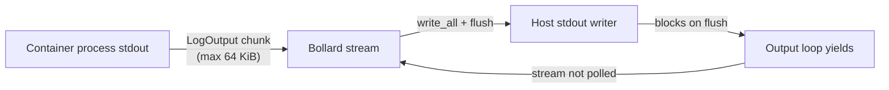

# Developer's guide

This guide is for maintainers and contributors working on the Podbot codebase.
It covers build and test workflows, subsystem architecture, and the
implementation contracts that code changes must preserve. For design rationale,
constraints, and intended evolution, see [podbot-design.md](podbot-design.md).
For user-facing behaviour and configuration reference, see
[users-guide.md](users-guide.md).

## 1. Normative references

- [AGENTS.md](../AGENTS.md): commit gating, code style, and Rust-specific
  guidance.
- [documentation-style-guide.md](documentation-style-guide.md): spelling,
  formatting, and document type conventions.
- [podbot-design.md](podbot-design.md): architecture, security model,
  error handling, and design rationale.

## 2. Build, test, and lint

All quality gates must pass before committing. The canonical targets are:

| Target              | Command                                                                | Purpose                       |
| ------------------- | ---------------------------------------------------------------------- | ----------------------------- |
| `make check-fmt`    | `cargo fmt --workspace -- --check`                                     | Verify formatting             |
| `make fmt`          | `cargo fmt --workspace`                                                | Apply formatting fixes        |
| `make lint`         | `cargo clippy --workspace --all-targets --all-features -- -D warnings` | Lint with all warnings denied |
| `make test`         | `cargo test --workspace`                                               | Run full test suite           |
| `make markdownlint` | markdownlint-cli                                                       | Validate Markdown files       |
| `make nixie`        | Mermaid diagram validator                                              | Validate diagrams in Markdown |

Run long commands through `tee` and `set -o pipefail` so truncated output can
be reviewed from the log file.

## 3. Repository layout (exec subsystem)

The exec subsystem lives under `src/engine/connection/exec/` and implements
container command execution across three modes.

```plaintext
src/engine/connection/exec/
+-- mod.rs               # Dispatch, ExecRequest/ExecResult types,
|                        #   ContainerExecClient trait, ExecMode enum,
|                        #   PROTOCOL_OUTPUT_CAPACITY constant
+-- protocol.rs          # Protocol proxy loops, stdin forwarding,
|                        #   Stdout Purity Contract, STDIN_BUFFER_CAPACITY,
|                        #   STDIN_SETTLE_TIMEOUT, ProtocolProxyIo
+-- attached.rs          # Attached-mode session, terminal resize,
|                        #   SIGWINCH handling, stdin echo forwarding
+-- terminal.rs          # Terminal size detection (stty), resize helpers,
|                        #   TerminalSizeProvider trait
+-- tests.rs             # Test module root
+-- tests/
    +-- protocol_proxy_bdd.rs         # BDD Gherkin scenarios
    +-- proxy_helpers/
    |   +-- mod.rs                    # Test helper root
    |   +-- lifecycle_purity.rs       # Stdout purity regression tests
    |   +-- forwarding.rs            # stdin/stdout forwarding tests
    |   +-- routing.rs               # Output routing (StdOut/StdErr/StdIn)
    |   +-- error_mapping.rs         # Error propagation tests
    |   +-- validation_tests.rs      # Request validation tests
    +-- detached_helpers.rs          # Detached mode test helpers
    +-- lifecycle_helpers.rs         # Shared lifecycle fixtures
    +-- protocol_helpers.rs          # Protocol-specific test helpers
```

### 3.1. Execution modes

| Mode     | Enum variant         | TTY         | Streams   | Resize | Use case                                          |
| -------- | -------------------- | ----------- | --------- | ------ | ------------------------------------------------- |
| Attached | `ExecMode::Attached` | Conditional | Forwarded | Yes    | Interactive terminal sessions (`podbot exec`)     |
| Detached | `ExecMode::Detached` | No          | None      | No     | Fire-and-forget commands (`podbot exec --detach`) |
| Protocol | `ExecMode::Protocol` | No          | Forwarded | No     | Byte-preserving proxy (`podbot host`)             |

_Table 1: Execution modes and their behavioural properties._

Attached mode enables TTY only when both local stdin and stdout are terminals.
Protocol mode permanently disables TTY, so the byte stream is not corrupted by
terminal framing.

### 3.2. Key types

- **`ExecRequest`**: validated parameters for an exec session (container
  identifier (ID), command, environment, mode, TTY flag).
- **`ExecResult`**: outcome carrying the daemon-assigned exec ID and exit
  code.
- **`ContainerExecClient`**: trait abstracting Bollard exec Application
  Programming Interface (API) calls for unit testability.
- **`ProtocolProxyIo<HostStdin, HostStdout, HostStderr>`**: generic
  host-IO bundle injected into the protocol proxy for testing.

## 4. Stdout Purity Contract

The protocol proxy must never write bytes to host stdout that did not originate
from container stdout or console output. The authoritative definition lives in
the module-level doc comment of `src/engine/connection/exec/protocol.rs`.

The contract requires:

- No banners, progress indicators, or status messages on stdout.
- No diagnostic output or error messages on stdout (route to stderr).
- No echoed stdin bytes (`LogOutput::StdIn` is silently dropped).
- No framing, escaping, or encoding of the byte stream.

### 4.1. Enforcement by construction

The function `run_protocol_session_with_io_async` accepts injected host-IO
handles via `ProtocolProxyIo` and only writes to host stdout in
`handle_log_output_chunk` for `LogOutput::StdOut` and `LogOutput::Console`
messages. All other code paths route to stderr or return errors without
touching stdout.

### 4.2. Enforcement by test

The `tests/proxy_helpers/lifecycle_purity.rs` module contains regression tests
covering:

- Startup purity (no bytes before proxied data).
- Steady-state purity with mixed stream types.
- Shutdown purity (no bytes after proxied data).
- Error-path purity (no stdout contamination on daemon stream failure).
- Stdin echo suppression (`LogOutput::StdIn` records are not forwarded).
- Zero stdout bytes when the daemon produces no stdout output.

These tests use `RecordingWriter` test doubles to capture bytes written to each
stream and assert that only expected content appears on stdout.

### 4.3. Contrast with attached mode

Attached mode intentionally echoes `LogOutput::StdIn` records to stdout for
interactive terminal feedback. Protocol mode must not do this because
stdio-framed servers would misinterpret echoed input bytes as protocol output.

## 5. Bounded buffering

Protocol-mode exec sessions use explicitly bounded buffers so backpressure
remains visible to the hosted server. All buffer sizes are set to 64 KiB
(65,536 bytes).

### 5.1. Constants

| Constant                   | Location      | Value    | Purpose                                                   |
| -------------------------- | ------------- | -------- | --------------------------------------------------------- |
| `STDIN_BUFFER_CAPACITY`    | `protocol.rs` | 65,536 B | `BufReader` capacity for host stdin reads                 |
| `PROTOCOL_OUTPUT_CAPACITY` | `mod.rs`      | 65,536 B | Bollard `output_capacity` per `LogOutput` chunk           |
| `STDIN_SETTLE_TIMEOUT`     | `protocol.rs` | 50 ms    | Grace period before aborting stdin forwarding at shutdown |

_Table 2: Bounded buffering constants for protocol-mode exec sessions._

The 64 KiB size aligns with common JSON Remote Procedure Call (JSON-RPC) frame
buffers and typical operating system (OS) pipe buffer defaults.

### 5.2. Stdin forwarding path

Host stdin is wrapped in a `BufReader` with `STDIN_BUFFER_CAPACITY` before
being copied to the container stdin writer via `tokio::io::copy`. This bounds
the maximum memory consumed per read cycle and provides backpressure by
limiting how many bytes can be in flight between host stdin reads and container
input writes.

The container stdin writer receives unbuffered writes from the copy operation.
Each write is followed by an explicit flush on the container input stream after
the copy completes, plus a shutdown call to signal end-of-input.

### 5.3. Output forwarding path

Bollard's `output_capacity` is set to `PROTOCOL_OUTPUT_CAPACITY` for
protocol-mode sessions via `build_start_exec_options`. This controls the
maximum bytes per `LogOutput` chunk delivered by the daemon, reducing per-chunk
overhead for large protocol messages.

Each output chunk is forwarded with `write_all()` followed by `flush()`. If the
host stdout writer blocks on flush, the output loop yields, the Bollard stream
stops being polled, and backpressure propagates to the container.

Non-protocol modes (attached and detached) leave `output_capacity` as `None`,
using Bollard's default 8 KiB chunk size.

### 5.4. Backpressure chain

For screen readers: The following diagram shows how backpressure propagates
from the host stdout consumer back to the container process.



_Figure 1: Backpressure propagation from host stdout to container._

## 6. Stdin forwarding lifecycle

Protocol-mode stdin forwarding runs as a spawned Tokio task
(`spawn_stdin_forwarding_task`). The lifecycle is:

1. Task reads from host stdin via `BufReader` and copies to container
   input.
2. On host stdin end-of-file (EOF), the copy completes, the task
   flushes and shuts down the container input writer.
3. If the container output stream completes while host stdin is still
   open, the output loop finishes first.
4. `settle_stdin_forwarding_task` waits up to `STDIN_SETTLE_TIMEOUT`
   (50 ms) for the stdin task to complete.
5. If the timeout expires, the task is aborted via
   `abort_stdin_forwarding_task` and an `ExecFailed` error is returned.
6. If the task completes within the timeout, its result is classified:
   `Ok(Ok(()))` is success, `Ok(Err(_))` is an IO forwarding failure, and
   `Err(cancelled)` is treated as success (expected during abort).

## 7. Adding a new exec mode

When adding a new execution mode:

1. Add the variant to `ExecMode` in `mod.rs`.
2. Update `is_attached()` and `is_protocol()` predicates as needed.
3. Add a match arm in `exec_async_with_terminal_size_provider`.
4. Decide whether `build_start_exec_options` should set
   `output_capacity` for the new mode.
5. Add tests covering the new mode's stream routing, buffering, and
   TTY behaviour.
6. Update `podbot-design.md` and this guide.

## 8. Testing conventions

### 8.1. Test organization

- Unit tests live in `tests.rs` submodules colocated with production
  code.
- Behaviour-Driven Development (BDD) scenarios use Gherkin-style naming
  in `protocol_proxy_bdd.rs`.
- Shared fixtures and helpers are grouped under `tests/proxy_helpers/`.

### 8.2. Test doubles

- `RecordingWriter`: captures bytes written to a stream for assertion.
- `ProtocolProxyIo::new(stdin, stdout, stderr)`: injects host-IO
  handles so tests can supply in-memory readers and writers.
- `run_lifecycle_session(runtime, stdin_bytes, output)`: convenience
  wrapper around `run_session` for lifecycle purity tests that only
  need to inspect stdout. It creates `RecordingWriter` handles
  internally and returns `(Result<(), PodbotError>,
  Arc<Mutex<Vec<u8>>>)` — the session result paired with captured
  stdout bytes.
- `ContainerExecClient` mock implementations for unit testing without a
  live daemon.

### 8.3. Parameterized tests

Use `#[rstest(...)]` to eliminate duplicated test cases. Group related
parameters in structs when the parameter list exceeds three items.

## 9. Error handling boundary

The exec subsystem maps failures to `PodbotError` via the `exec_failed` helper,
which produces `ContainerError::ExecFailed { container_id, message }`. Callers
receive semantic errors they can inspect and handle. The CLI boundary converts
these to `eyre::Report` for operator-facing display.

See [podbot-design.md, Error handling](podbot-design.md#error-handling) for the
full error hierarchy.
