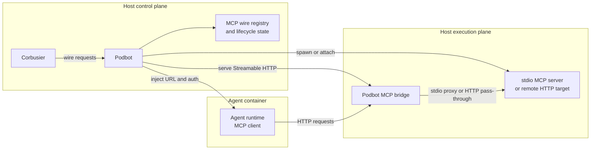

# MCP server hosting design

## Front matter

- Status: Proposed.
- Scope: How Podbot should expose Model Context Protocol (MCP) servers to
  containerized agents, and how a host orchestrator such as Corbusier should
  consume that surface.
- Primary audience: Podbot and Corbusier maintainers working on hosting mode.
- Precedence:
  [docs/podbot-design.md](docs/podbot-design.md) remains the primary design
  document for Podbot itself, and
  [docs/podbot-roadmap.md](docs/podbot-roadmap.md) remains the source of truth
  for delivery sequencing. This document refines the MCP-specific hosting shape
  that those documents imply.

## 1. Problem statement

Podbot already aims to host long-lived app-server processes inside sandboxed
containers while keeping Podbot's own stdout protocol-pure. That direction is
visible in the main design document and in the roadmap work for protocol-safe
execution. The remaining design gap is how those hosted agents should reach MCP
servers without turning the agent image into an ever-growing bundle of helper
binaries.

The design needs to answer three questions:

1. Which component owns MCP server selection, policy, and lifecycle intent.
2. Which component owns container wiring, transport bridging, and cleanup.
3. Which transport Podbot should present to agents running inside containers.

The recommended answer is that Corbusier should remain the policy and registry
layer, while Podbot should own the transport and container wiring needed to
make those MCP servers reachable from the sandbox.

## 2. Design goals and non-goals

### 2.1 Goals

- Keep the agent container focused on the agent runtime rather than on a large
  catalogue of locally installed MCP server binaries.
- Preserve the protocol-purity rule already established for `podbot host`:
  hosted protocols own stdout, and Podbot diagnostics belong on stderr.
- Expose a standards-based transport that common MCP clients can consume
  without Podbot-specific SDK work.[^1]
- Keep container-engine privilege inside Podbot rather than pushing that
  responsibility into Corbusier.
- Make cleanup, authentication, and reachability explicit parts of the
  hosting contract.

### 2.2 Non-goals

- This document does not define the full Corbusier tool registry schema.
- This document does not define a cross-repository tenancy policy model.
- This document does not require Podbot to implement every historical MCP
  transport variant on day one.
- This document does not replace the roadmap. It narrows the intended shape of
  upcoming hosting work.

## 3. Constraints

### 3.1 Podbot constraints

Podbot has two first-class delivery surfaces: a Command-Line Interface (CLI)
and an embeddable Rust library. Any MCP hosting design has to work for both.
The library must expose typed orchestration primitives, while the CLI remains
an adapter that handles argument parsing, operator output, and exit codes.

Podbot's existing design also imposes a strict protocol boundary for hosting
mode:

- `podbot host` must not write non-protocol bytes to stdout.
- Long-lived hosted sessions should run without TTY framing.
- Lifecycle diagnostics should be preserved on stderr.

Those rules are already useful for Agent Client Protocol (ACP) hosting, and
they map cleanly onto MCP hosting as well.

### 3.2 MCP constraints

MCP standardizes `stdio` and Streamable HTTP, the transport built on Hypertext
Transfer Protocol (HTTP).[^1] JSON Remote Procedure Call (JSON-RPC) defines
message structure, but it does not define framing on its own.[^2] That means
Podbot cannot treat "JSON-RPC" as the whole transport design; it has to honour
the framing and protocol-purity rules imposed by the chosen MCP transport.

For Podbot, the important consequences are:

- A bridged `stdio` server needs strict line-framed proxying and stdout
  purity.[^1]
- An HTTP-facing endpoint needs explicit request handling, authentication, and
  origin checks.[^1]
- Unix domain sockets may still be useful for Podbot's internal control plane,
  but they are not the interoperable default that an arbitrary MCP client
  should be expected to understand.[^1]

### 3.3 Container runtime constraints

Container runtimes give Podbot networking primitives, not a magical "make host
services appear in the container" feature. On Docker-class runtimes, the
relevant portable mechanism is to make a host-side service reachable from the
container by using `host.docker.internal` or an injected `host-gateway`
mapping.[^3]

That keeps the agent image simple, but it also means Podbot has to manage bind
addresses, per-wire authentication, and cleanup instead of assuming the
networking model is safe by default.

Primary repositories inside the Podbot agent container should live on a volume
rather than in the container's ephemeral writable layer. That gives Podbot a
stable mount target for the agent's main working tree and provides a controlled
mechanism for sharing the same repository contents with auxiliary MCP
containers when a server definition explicitly requests that access.

## 4. Responsibilities and boundaries

Corbusier and Podbot should split ownership along existing architectural
strengths instead of duplicating capabilities.

| Component       | Owns                                                                                                                                            | Does not own                                                                                             |
| --------------- | ----------------------------------------------------------------------------------------------------------------------------------------------- | -------------------------------------------------------------------------------------------------------- |
| Corbusier       | Tool registry, policy, tenancy rules, allowed MCP server set per task, and when wires should exist                                              | Direct container-engine access, bind-address policy, or subprocess supervision for MCP bridges           |
| Podbot          | Container creation, host-to-container reachability, MCP transport bridging, auth token injection, lifecycle cleanup, and protocol-safe proxying | Deciding which tool a tenant may use, or acting as the long-term system of record for the tool catalogue |
| Agent container | Consuming an MCP endpoint using standard client behaviour                                                                                       | Spawning arbitrary host-side MCP servers or discovering Podbot internals                                 |

Table 1: Proposed responsibility split between Corbusier, Podbot, and the agent
container.

This split keeps container privilege close to the component that already owns
container orchestration, and it lets Corbusier stay focused on policy rather
than on runtime mechanics.

## 5. Recommended architecture

The recommended architecture is:

1. Corbusier decides which MCP servers a task may use.
2. Corbusier asks Podbot to create wires for that subset.
3. Podbot starts or registers the necessary host-side MCP bridge endpoints.
4. Podbot injects the resulting endpoint details into the container.
5. The agent talks to those endpoints over Streamable HTTP.



Figure 1: Corbusier chooses wires, Podbot owns the bridge, and the container
only sees standard MCP endpoints.

The important design choice is that Podbot should normalize agent-facing
traffic to Streamable HTTP whenever it is acting as the bridge owner. That
keeps the in-container integration simple: the agent needs an HTTP client and
wire metadata, not a locally installed server binary or a Podbot-specific
transport adapter.

## 6. Transport model

### 6.1 Agent-facing transport

Podbot should present Streamable HTTP to the agent container by default.[^1]
That default works whether the original source is:

- a stdio-only MCP server that Podbot launches and proxies, or
- a stdio MCP server that Podbot runs in a dedicated helper container, or
- a remote HTTP-capable MCP server that Podbot forwards directly or through a
  thin reverse proxy.

This gives Podbot a single data-plane contract to inject into the container:
Uniform Resource Locator (URL), protocol version expectations and
authentication material.

### 6.2 Stdio source handling

Some MCP servers are only available as `stdio` producers. Podbot should support
those servers whether they run as local subprocesses or in dedicated helper
containers, and it should bridge the MCP stream to an HTTP endpoint.

That bridge must:

- preserve the framing expected by the stdio transport,[^1]
- keep stdout free of host-generated noise,
- log bridge diagnostics to stderr,
- bound buffers so slow readers surface backpressure instead of causing
  unbounded memory growth, and
- tear down the underlying subprocess or helper container when the workspace
  or wire is destroyed.

When Podbot launches a stdio MCP server in a helper container, the primary
repository volume should remain mounted into the agent container as the source
of truth for the task workspace. Podbot may additionally mount that same volume
into the MCP container only when the server definition requests repo access
explicitly. The access modes should be:

- `none`: do not mount the repository volume into the MCP container.
- `read_only`: mount the repository volume read-only into the MCP container.
- `read_write`: mount the repository volume read-write into the MCP container.

The default should be `none`. Repo sharing is a trust-boundary decision, so it
should never happen implicitly. If an operator wants a stdio MCP container to
inspect or mutate the task repository, that intent should be visible in the
server definition through an explicit repo-access field.

### 6.3 Remote HTTP source handling

When the source server already exposes Streamable HTTP, Podbot may choose one
of two strategies:

- direct injection of the remote URL when no additional policy or observability
  layer is needed, or
- a Podbot-managed reverse proxy when Podbot needs to enforce auth, origin
  policy, or traffic accounting consistently across wires.

The reverse proxy path costs more complexity, but it keeps the operational
model consistent with bridged stdio servers.

| Source type                                   | Agent-facing transport            | Recommendation                                            | Rationale                                                              |
| --------------------------------------------- | --------------------------------- | --------------------------------------------------------- | ---------------------------------------------------------------------- |
| stdio subprocess                              | Streamable HTTP via Podbot bridge | Required                                                  | Keeps binaries out of the container while preserving interoperability  |
| stdio helper container                        | Streamable HTTP via Podbot bridge | Supported when isolation or extra dependencies justify it | Allows containerized stdio tools while keeping repo sharing explicit   |
| Remote Streamable HTTP server                 | Direct URL or Podbot proxy        | Preferred when the source is already standards-based      | Avoids unnecessary translation when no extra control is required       |
| Custom transport such as a Unix domain socket | Not exposed directly to the agent | Avoid as the default                                      | Too much client-specific integration work for a shared hosting surface |

Table 2: Recommended transport decisions by MCP source type.

## 7. Security and operational model

### 7.1 Control plane

Podbot's privileged control plane should stay local. A Unix domain socket is a
reasonable transport for a future Podbot daemon because it keeps file-system
permissions available as a coarse access control layer. A short-term CLI or
library call path is also acceptable while the design is still being delivered.

The control plane is not the same thing as the MCP data plane. The former is a
privileged Podbot orchestration interface. The latter is the endpoint exposed
to the agent runtime.

### 7.2 Data plane

When Podbot exposes an MCP endpoint for the container to consume, it should:

- bind only to the narrowest address that still makes the service reachable,
- prefer host-gateway-style reachability over wide-open published ports,[^3]
- issue a distinct auth token per wire or per workspace,
- inject auth through configuration rather than expecting the operator to copy
  secrets manually, and
- reject unauthenticated traffic even when the bind address is accidentally
  broader than intended.

### 7.3 Logging and protocol purity

The host process must continue to treat stdout as owned by the hosted protocol.
That rule applies both to direct `podbot host` execution and to any future
daemon or library surface that proxies MCP traffic.

Operationally, that means:

- protocol bytes go to stdout only when stdout is the selected MCP transport,
- lifecycle diagnostics go to stderr,
- structured host-side logs must never be mixed into the proxied protocol
  stream, and
- bridge failures should surface as semantic errors in the library API and as
  actionable diagnostics in the CLI.

## 8. Proposed Podbot surface

### 8.1 CLI shape

Podbot should grow an MCP-focused command group that fits the existing
subcommand model:

- `podbot wire mcp add`
- `podbot wire mcp remove`
- `podbot wire mcp list`

These commands should support a structured JSON mode so Corbusier can consume
them without scraping human-oriented output.

When the command surface defines a stdio MCP helper container, it should also
accept an explicit repo-access setting with the same semantics as the library
application programming interface (API): no mount by default, read-only volume
sharing when requested, and read-write volume sharing only when requested.

### 8.2 Library shape

The library should expose a typed application programming interface (API)
boundary rather than stringly typed shell output. The exact type names can
change, but the shape should be close to the following:

```rust
pub enum McpSource {
    Stdio {
        command: String,
        args: Vec<String>,
        env: Vec<(String, String)>,
        cwd: Option<String>,
    },
    StdioContainer {
        image: String,
        command: Vec<String>,
        env: Vec<(String, String)>,
        repo_access: RepoAccess,
    },
    StreamableHttp {
        url: String,
        headers: Vec<(String, String)>,
    },
}

pub enum RepoAccess {
    None,
    ReadOnly,
    ReadWrite,
}

pub struct CreateMcpWireRequest {
    pub workspace_id: String,
    pub name: String,
    pub source: McpSource,
}

pub struct CreateMcpWireResponse {
    pub url: String,
    pub headers: Vec<(String, String)>,
}
```

This keeps the boundary narrow:

- Corbusier says what should be wired.
- Podbot returns how the container should reach it.
- Podbot keeps lifecycle and transport details private behind its own types.

`RepoAccess` should govern only whether Podbot mounts the primary repository
volume into a stdio MCP helper container. It should not change the agent
container's own access to the primary task repository.

### 8.3 Configuration shape

Podbot should add an `mcp` section to `AppConfig` for defaults that affect all
hosting wires. Expected settings include:

- bind strategy,
- idle timeout,
- maximum message size,
- auth token policy, and
- allowed-origin policy for HTTP-facing endpoints.

Those settings belong in Podbot because they are part of how Podbot safely
hosts and exposes wires, not part of how Corbusier chooses which wires should
exist.

## 9. Delivery phases

The design can be delivered incrementally.

### 9.1 Phase 1: stdio-safe hosting foundation

- Finish the roadmap work for protocol-safe execution.
- Ensure Podbot can run long-lived non-TTY sessions with strict stdout purity.
- Reuse that machinery for a single bridged stdio MCP server.

### 9.2 Phase 2: first-class MCP wire lifecycle

- Add typed wire creation and teardown APIs.
- Add CLI subcommands with JSON output.
- Inject Streamable HTTP wire metadata into the container during provisioning.

### 9.3 Phase 3: security hardening and multi-wire support

- Add per-wire auth tokens.
- Add origin validation for HTTP-facing bridges.[^1]
- Add cleanup, idle expiry, and observability for multiple concurrent wires.

### 9.4 Phase 4: optional remote-server proxying

- Support direct pass-through for remote Streamable HTTP servers.
- Add a Podbot-managed reverse proxy only when policy or observability needs
  justify the extra moving parts.

## 10. Risks, trade-offs, and open questions

### 10.1 Risks and trade-offs

- Making Podbot MCP-aware increases Podbot scope. The payoff is that container
  privilege and transport complexity stay in one place.
- A thin reverse proxy is operationally attractive, but it becomes another
  long-lived service that needs teardown discipline and metrics.
- Direct remote URL injection is simpler than proxying, but it yields weaker
  observability and less consistent policy enforcement.

### 10.2 Open questions

- Should Podbot expose a long-lived daemon interface, or should Corbusier call
  it through the library and keep process lifetime inside Corbusier?
- Should the first implementation support only stdio-backed wires, or should it
  handle direct remote HTTP servers in the same milestone?
- How should Corbusier encode per-task wire configuration for agents that
  expect different MCP client configuration shapes?

## 11. Recommendation

Podbot should own MCP server wiring for containerized agents, and it should
present those wires to the container as Streamable HTTP endpoints. Corbusier
should remain the policy and registry authority, but it should not absorb
container-engine privilege or low-level proxy mechanics that Podbot is already
better placed to own.

That recommendation is consistent with Podbot's existing hosting direction:
keep the sandbox small, keep stdout protocol-pure, and make the host-side
orchestrator responsible for the dangerous parts.

[^1]: <https://modelcontextprotocol.io/specification/2025-11-05/basic/transports>
[^2]: <https://www.jsonrpc.org/specification>
[^3]: <https://docs.docker.com/reference/cli/dockerd/#configure-host-gateway-ip>
