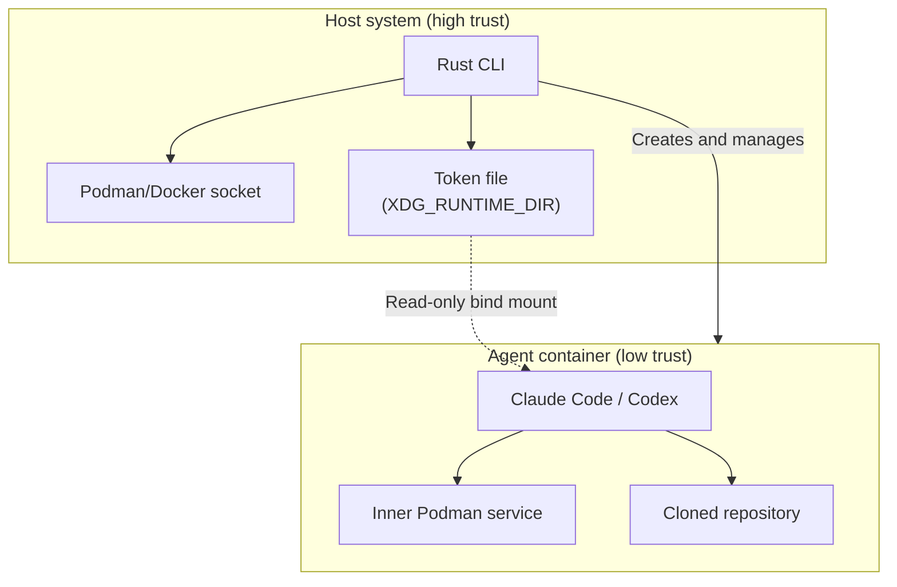
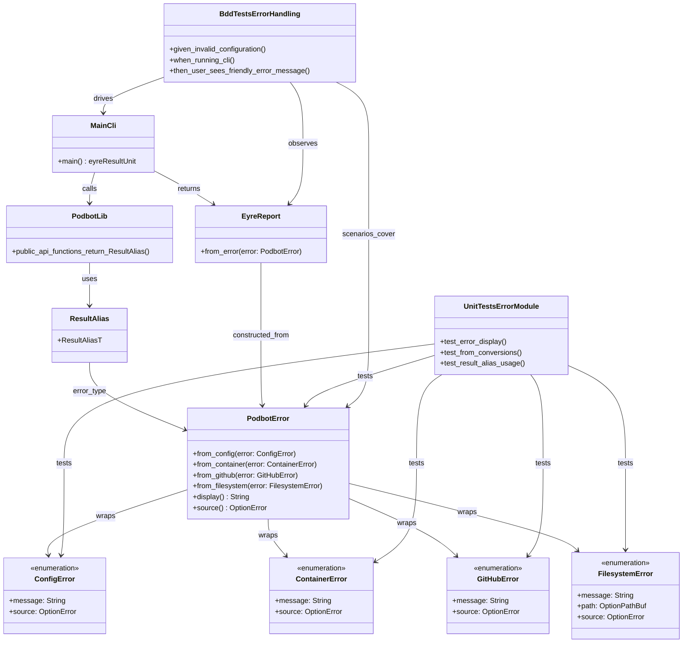

# Sandboxed agent runner design

This document describes a sandboxed execution environment for running AI coding
agents (Claude Code, Codex) with repository access. The design prioritizes
security by treating the host container engine as high-trust infrastructure,
while the agent container operates in a low-trust playpen with no access to the
host socket.

## Overview

The core principle is straightforward: the Rust Command-Line Interface (CLI)
acts as the sole holder of the host Podman or Docker socket. The agent
container never receives access to this socket. Instead, the agent runs an
inner Podman service for any nested container operations (such as `act` for
GitHub Actions or `cross` for cross-compilation), ensuring that mount paths
resolve within the sandbox filesystem rather than the host.

For screen readers: The following diagram illustrates the trust boundary
between the host CLI and the sandboxed agent container.



_Figure 1: Trust boundaries between host CLI and sandboxed agent._

## Execution flow

The CLI orchestrates container creation and agent execution through eight steps.

1. **Create outer container** from a pre-configured image containing:

   - `podman`, `fuse-overlayfs`, and `slirp4netns` for the inner engine
   - `git`
   - `claude` and `codex` binaries
   - A helper script for Git authentication via token file

2. **Inject agent credentials** from `~/.claude` and `~/.codex` by copying into
   the container filesystem using Bollard's `upload_to_container` method.[^1]
   Bind-mounting the home directory would expose unnecessary host state.

3. **Configure Git identity** by reading `user.name` and `user.email` from the
   host and executing `git config --global` within the container.

4. **Create a GitHub App installation access token** using Octocrab.[^2]
   Installation tokens expire after one hour.[^3]

5. **Start a token renewal daemon** that refreshes the installation token before
   expiry. Rather than repeatedly executing commands or copying files into the
   container, this daemon writes the token to a host-side file and relies on a
   read-only bind mount for the container to observe updates.

6. **Clone the repository** specified by the operator. GitHub supports
   Hypertext Transfer Protocol (HTTP) access using the installation token in
   the form `x-access-token:TOKEN@github.com/owner/repo`.[^3] However,
   embedding tokens in Uniform Resource Locators (URLs) risks leaking
   credentials into process arguments and shell history. A safer approach uses
   `GIT_ASKPASS` with a script that reads from `/run/secrets/ghapp_token`.

7. **Start the agent in permissive mode**, attached to the terminal:

   - Claude Code: `claude --dangerously-skip-permissions`[^4]
   - Codex CLI: `codex --dangerously-bypass-approvals-and-sandbox`[^5]

## Security model

The design establishes clear trust boundaries.

| Component       | Trust level | Socket access     | Notes                                     |
| --------------- | ----------- | ----------------- | ----------------------------------------- |
| Rust CLI        | High        | Host socket       | Single auditable chokepoint               |
| Agent container | Low         | Inner socket only | Cannot reach host engine                  |
| Token daemon    | High        | None              | Runs on host, writes to runtime directory |

_Table 1: Trust levels and socket access by component._

The agent container cannot escalate to host access because:

- It never receives the host Podman or Docker socket.
- Nested containers operate via an inner Podman socket, so any mounts resolve
  within the container filesystem.
- GitHub token refresh occurs outside the container; the agent observes a
  read-only file.

This design does not eliminate all risk. Container isolation depends on kernel
security boundaries. A container escape vulnerability would compromise the host
user account. Virtual machines (VMs) provide stronger isolation guarantees but
at the cost of operational complexity.

For additional hardening, network egress could be restricted to model endpoints
and GitHub. Both Claude Code and Codex documentation note prompt injection
risks when broad network access is enabled.[^4][^5]

## Error handling boundary

See "Error handling" below for the detailed error boundary description.

## Token management

GitHub App installation tokens present a credential lifecycle challenge: they
expire after one hour and must be refreshed without interrupting the agent.

The token strategy works as follows:

1. On container creation, the CLI establishes a runtime directory at
   `$XDG_RUNTIME_DIR/podbot/<container_id>/`.

2. The CLI writes the initial token to `ghapp_token` within this directory,
   with mode `0600` and directory mode `0700`.

3. The container receives a read-only bind mount:
   `<token_path>:/run/secrets/ghapp_token:ro`.

4. The token daemon refreshes the token with a time buffer using Octocrab's
   `installation_token_with_buffer` method,[^2] writing atomically via rename
   from a temporary file.

5. Inside the container, `GIT_ASKPASS` reads the mounted file, ensuring Git
   operations continue working after token refresh.

```rust,no_run
// Token refresh pseudocode
let octocrab = Octocrab::builder()
    .app(app_id, private_key)
    .build()?;

let installation = octocrab.installation(installation_id);
let token = installation
    .installation_token_with_buffer(Duration::from_secs(300))
    .await?;

// Atomic write: create temporary, then rename
let temp_path = token_path.with_extension("new");
std::fs::write(&temp_path, token.as_str())?;
std::fs::rename(&temp_path, &token_path)?;
```

## Crate selection

The implementation relies on three primary crates.

### Bollard

Bollard provides a Docker Application Programming Interface (API) client that
connects to Unix sockets via `DOCKER_HOST` or direct path specification.[^1]
Key methods include:

- `create_container` and `start_container` for lifecycle management
- `upload_to_container` for injecting credentials as tar archives
- `exec` with TTY attachment for interactive agent sessions

### Octocrab

Octocrab handles GitHub App authentication and token management.[^2] The
`OctocrabBuilder::app(app_id, key)` constructor establishes App identity, and
the installation method acquires scoped tokens with automatic caching.

### OrthoConfig

OrthoConfig provides layered configuration with predictable precedence: CLI
flags override environment variables, which override configuration files, which
override defaults.[^6] The derive macro generates the layering logic from
annotated structs.

## Configuration

The CLI reads configuration from `~/.config/podbot/config.toml` with
environment and flag overrides.

```toml
engine_socket = "unix:///run/user/1000/podman/podman.sock"
image = "ghcr.io/example/podbot-sandbox:latest"

[github]
app_id = 12345
installation_id = 67890
private_key_path = "/home/user/.config/podbot/github-app.pem"

[workspace]
base_dir = "/work"

[creds]
copy_claude = true
copy_codex = true

[sandbox]
privileged = false
mount_dev_fuse = true

[agent]
kind = "codex"
mode = "podbot"
```

The `agent.mode` setting defines the execution mode for the agent. The current
implementation accepts only `podbot`, which indicates the default
podbot-managed execution path. This value is reserved for future expansion when
additional execution modes are introduced.

The `sandbox.privileged` setting controls the trade-off between compatibility
and isolation. Privileged mode enables more Podman-in-Podman configurations but
expands the attack surface. The minimal mode mounts only `/dev/fuse` and avoids
the privileged flag.

## Error handling

Podbot defines semantic error enums in `src/error.rs` for configuration,
container, GitHub, and filesystem operations. These enums are aggregated by
`PodbotError`, and modules return `podbot::error::Result<T>` so callers can
match on domain failures. The binary keeps opaque reporting at the boundary by
returning `eyre::Result<()>` from `main` and converting domain errors into
`eyre::Report` only when presenting messages to the operator.

For screen readers: The following diagram summarizes the error types and how
they flow from library modules to the CLI entry point.



## CLI interface

The CLI exposes a minimal surface area.

```plaintext
podbot run --repo owner/name --agent codex|claude
podbot token-daemon
podbot ps
podbot stop <container>
podbot exec <container> <command>
```

The `run` subcommand orchestrates the full execution flow. The `token-daemon`
subcommand can run standalone, potentially as a user systemd service, to manage
token refresh independently of active sessions.

## Module structure

A suggested organisation for maintainability:

```plaintext
src/
├── main.rs             # Configuration loading, subcommand dispatch
├── config/             # Configuration module (CLI + structs + tests)
│   ├── mod.rs          # Module docs and re-exports
│   ├── cli.rs          # Clap argument definitions
│   ├── types.rs        # AppConfig, GitHubConfig, SandboxConfig, AgentConfig
│   └── tests.rs        # Unit tests for configuration types
├── engine.rs           # Bollard wrapper: connect, create, upload, exec
├── github.rs           # Octocrab App authentication, token acquisition
├── token_daemon.rs     # Token refresh loop, atomic file writes
└── run_flow.rs         # Orchestration of steps 1–7
```

The `engine.rs` module encapsulates all Bollard interactions, providing a
testable abstraction over container operations. The `github.rs` module handles
Octocrab configuration and token acquisition without exposing API details to
calling code.

## Container image requirements

The sandbox image must support nested Podman execution. Required components:

- `/dev/fuse` access for `fuse-overlayfs` storage driver
- User namespace support and `slirp4netns` for rootless networking
- Appropriate capabilities or security options depending on Security-Enhanced
  Linux (SELinux) policy

The image should pre-install Git, the agent binaries, and a `GIT_ASKPASS`
helper script that reads `/run/secrets/ghapp_token`.

## Threat model summary

The design accepts that the agent can damage the cloned repository and make
network requests from within the sandbox. The design prevents the agent from:

- Accessing the host container socket
- Mounting arbitrary host paths via nested containers
- Observing or modifying credentials beyond the scoped installation token
- Persisting changes outside the container filesystem

The residual risk is kernel-level container escape. Operators requiring
stronger guarantees should consider VM-based isolation.

______________________________________________________________________

[^1]: Bollard Docker struct documentation:
      <https://docs.rs/bollard/latest/bollard/struct.Docker.html>

[^2]: Octocrab builder and installation token documentation:
      <https://docs.rs/octocrab/latest/octocrab/struct.OctocrabBuilder.html>

[^3]: GitHub App installation authentication:
      <https://docs.github.com/en/apps/creating-github-apps/authenticating-with-a-github-app/authenticating-as-a-github-app-installation>

[^4]: Claude Code best practices, including permissive mode:
      <https://www.anthropic.com/engineering/claude-code-best-practices>

[^5]: Codex CLI security documentation:
      <https://developers.openai.com/codex/security/>

[^6]: OrthoConfig repository:
      <https://github.com/leynos/ortho-config>
