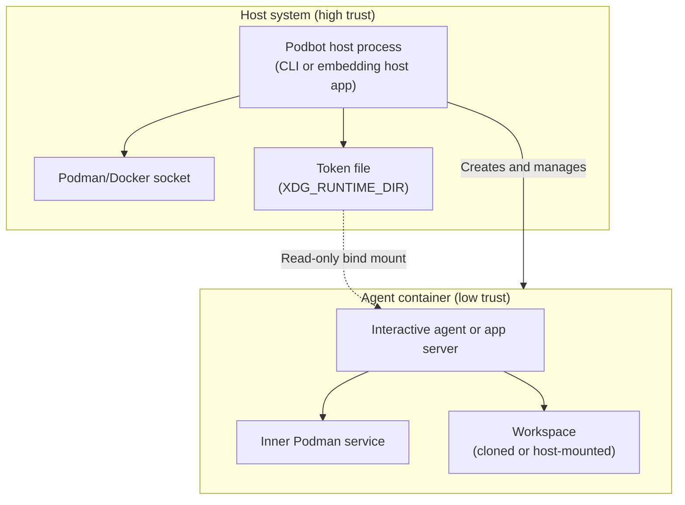
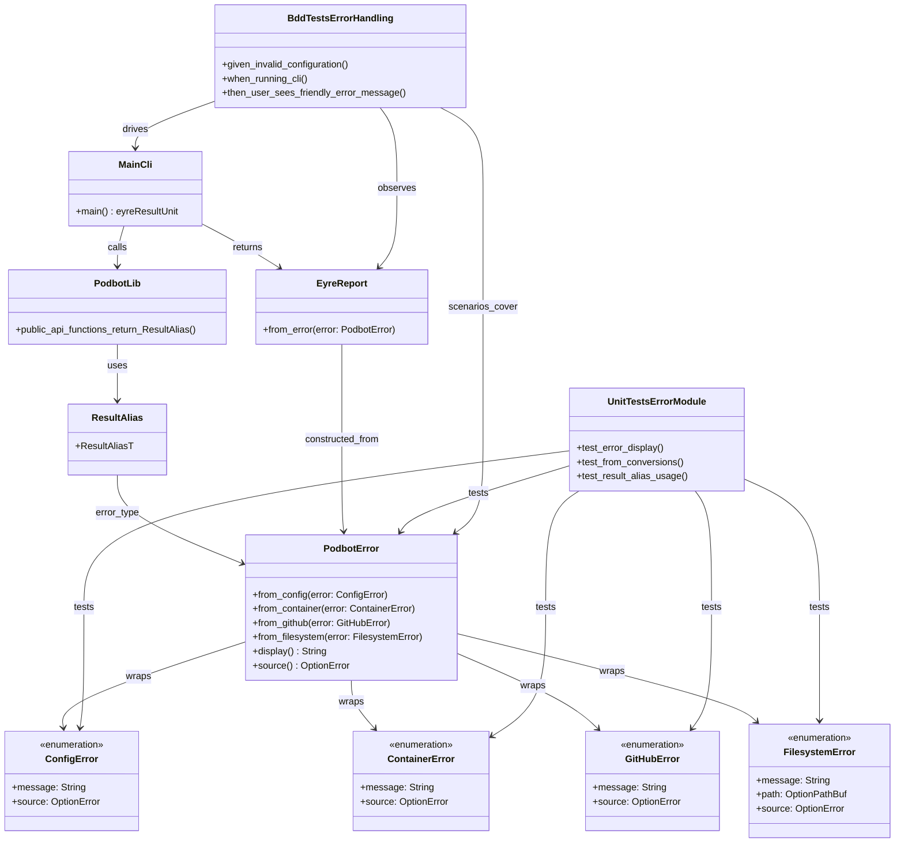
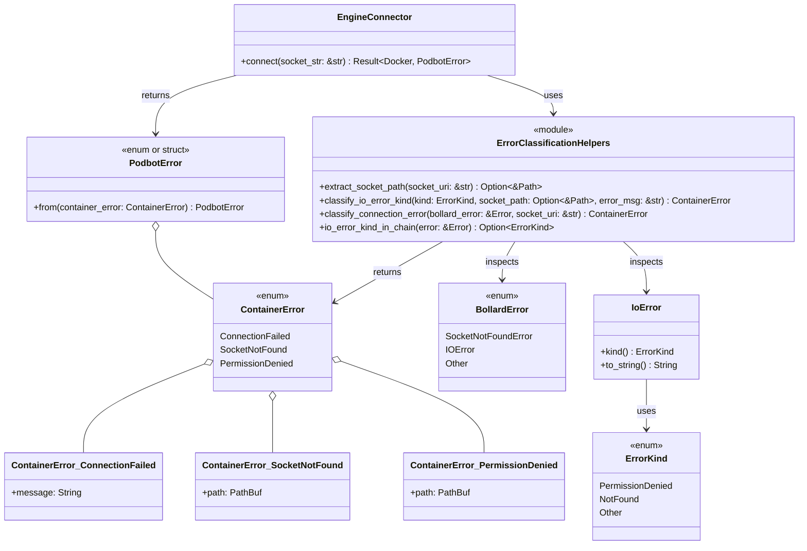

# Sandboxed agent runner design

This document describes a sandboxed execution environment for running AI coding
agents and app servers (Claude Code, Codex, Codex App Server, Agent Client
Protocol (ACP) agents) with repository access. The design prioritizes security
by treating the host container engine as high-trust infrastructure, while the
agent container operates in a low-trust playpen with no access to the host
socket. Podbot must be usable both as a Command-Line Interface (CLI) tool and
as an embeddable Rust library for larger agent-hosting systems.

## Overview

The core principle is straightforward: Podbot core logic is the sole holder of
the host Podman or Docker socket. Whether called by the Podbot CLI or by a host
application embedding the library, the agent container never receives access to
this socket. Instead, the agent runs an inner Podman service for any nested
container operations (such as `act` for GitHub Actions or `cross` for
cross-compilation), ensuring that mount paths resolve within the sandbox
filesystem rather than the host.

For screen readers: The following diagram illustrates the trust boundary
between the host control process (CLI or embedding host application) and the
sandboxed agent container.



_Figure 1: Trust boundaries between host control process and sandboxed agent._

## Dual delivery model

Podbot has two first-class delivery surfaces:

- A Podbot binary for terminal operators.
- A Podbot library API for embedding within larger agent-hosting tools.

The library owns orchestration primitives, default workflow implementations,
and semantic error handling. The host process (CLI or embedding application)
controls lifecycle by deciding when and how to call those library APIs. The CLI
is an adapter layer that handles:

- Argument parsing via Clap.
- Operator-facing output formatting.
- Process exit code conversion and `std::process::exit` invocation.

Library APIs must not depend on CLI-only types and must not perform direct
process termination. Library functions return typed request and response values
plus semantic errors (`PodbotError`) so host applications can integrate their
own logging, retries, scheduling, and policy controls.

Within the Podbot binary, execution is intentionally split into two operating
paths:

- `podbot run`: interactive human-operated sessions.
- `podbot host`: protocol-only app server hosting with strict stdout purity.

## Execution flow

The host process (CLI or embedding application) initiates orchestration by
calling the Podbot library. The library then performs container creation,
workspace preparation, and agent execution through seven steps.

<!-- markdownlint-disable MD029 -->

1. **Create outer container** from a pre-configured image containing:

   - `podman`, `fuse-overlayfs`, and `slirp4netns` for the inner engine
   - `git`
   - `claude` and `codex` binaries
   - Node.js runtime for JavaScript-based ACP agents
   - Python 3.10+ for Claude Agent SDK wrappers
   - A helper script for Git authentication via token file

2. **Inject agent credentials and selected environment secrets** into the
   container. Credential families such as `~/.claude` and `~/.codex` are copied
   via Bollard's `upload_to_container` method,[^1] while host environment
   values are passed through an explicit allowlist (`agent.env_allowlist`).
   Bind mounts of home directories are avoided to prevent exposing unrelated
   host state.

3. **Configure Git identity** by reading `user.name` and `user.email` from the
   host and executing `git config --global` within the container.

4. **If `workspace.source = "github_clone"`**, create a GitHub App installation
   access token using Octocrab.[^2] Installation tokens expire after one
   hour.[^3]

5. **If `workspace.source = "github_clone"`**, start a token renewal daemon that
   refreshes the installation token before expiry. Rather than repeatedly
   executing commands or copying files into the container, this daemon writes
   the token to a host-side file and relies on a read-only bind mount for the
   container to observe updates.

6. **Prepare the workspace** according to `workspace.source`:

   - `github_clone`: clone the repository specified by the operator. GitHub
     supports Hypertext Transfer Protocol (HTTP) access using the installation
     token in the form `x-access-token:TOKEN@github.com/owner/repo`.[^3]
     However, embedding tokens in Uniform Resource Locators (URLs) risks
     leaking credentials into process arguments and shell history. A safer
     approach uses `GIT_ASKPASS` with a script that reads from
     `/run/secrets/ghapp_token`.
   - `host_mount`: bind-mount a host directory (`workspace.host_path`) into the
     container at `workspace.container_path` and set the agent working
     directory to that mounted path. GitHub token acquisition and clone steps
     are skipped unless explicitly requested by the operator.

7. **Start the selected execution path**:

   - **7a. Interactive path (invoked by `podbot run`,
     `agent.mode = "podbot"`):** start the agent in permissive mode with
     terminal attachment:

     - Claude Code: `claude --dangerously-skip-permissions`[^4]
     - Codex CLI: `codex --dangerously-bypass-approvals-and-sandbox`[^5]
   - **7b. Protocol hosting path (invoked by `podbot host`,
     `agent.mode = "codex_app_server"` or `"acp"`):** start a long-lived
     non-TTY server command in the container and proxy protocol streams:

     - Codex App Server (stdio): `codex app-server --listen stdio://`[^7]
     - OpenCode ACP bridge: `opencode acp`[^8]
     - Droid ACP bridge: `droid-acp`[^8]
     - Goose ACP mode (as documented by Goose)[^9]
     - Optional future transport: WebSocket for Codex App Server[^7]

<!-- markdownlint-enable MD029 -->

In app server hosting mode, Podbot's stream contract is strict:

- TTY allocation is disabled (`tty = false`) for protocol exec sessions.
- Podbot stdout is a pure bridge of protocol bytes from container stdout.
- Podbot diagnostics and lifecycle logs are written to stderr only.
- Proxy logic preserves framing without adding prefixes or newline
  transformations, and uses bounded buffering so backpressure remains visible
  to the hosted server.[^7] [^10]

The dedicated `podbot host` command is protocol-only. Unlike interactive
operator commands, it must not emit banners, progress lines, or lifecycle
status text to stdout at startup, steady-state, shutdown, or error boundaries.
All such diagnostics must be routed to stderr.

ACP hosting defaults to sandbox-preserving capability masking:

- Podbot rewrites the ACP `initialize` exchange to remove client capabilities
  that would execute on the IDE host (`terminal/*` and `fs/*`).
- Podbot can reject those ACP method calls defensively if an agent still emits
  them.
- An explicit operator override may allow ACP delegation when host-executed
  tools are intentionally desired.

ACP masking is an implementation requirement, not a documentation preference:

- Podbot must parse the ACP initialization handshake and remove blocked
  capability families before forwarding capability data to the hosted agent.
- Podbot must maintain a runtime denylist for blocked ACP methods and return a
  protocol error if those methods are attempted later in the session.
- The delegation override must be explicit, disabled by default, and surfaced
  in logs as a trust-boundary change.

### Host-mount path safety policy

`workspace.source = "host_mount"` requires explicit mount-boundary checks:

- Canonicalize `workspace.host_path` before mount creation.
- Reject host paths outside configured allowlisted roots.
- Reject symlink-derived escapes that resolve outside allowed roots.
- Require absolute container target paths for `workspace.container_path`.
- Record resolved mount source and target paths in stderr diagnostics so
  operators can audit effective boundaries.

## Credential injection contract

Credential injection is implemented by
`EngineConnector::upload_credentials_async` and follows a fixed contract:

- The upload target inside the container is `/root`, with credential families
  resolved to `/root/.claude` and `/root/.codex`.
- Source selection is driven by `CredsConfig` toggles:
  `copy_claude` selects `~/.claude`, and `copy_codex` selects `~/.codex`.
- Selected source directories that are missing on the host are skipped instead
  of failing the run.
- When no selected source is present (including when both toggles are
  disabled), credential injection is a successful no-op and no daemon upload is
  attempted.
- Tar headers preserve permission mode metadata from the source filesystem, so
  credential files retain readable permissions expected by agent binaries.
- The result reports expected in-container credential paths in deterministic
  order (`/root/.claude` then `/root/.codex`) for families that were both
  selected and present.

Host-side credential selection and archive construction failures are mapped to
`FilesystemError::IoError`, while Bollard `upload_to_container` failures are
mapped to `ContainerError::UploadFailed` with the target `container_id`.

For app server hosting, environment secret passthrough follows a separate
contract:

- `agent.env_allowlist` names host environment variables that are copied into
  the container process environment.
- Missing allowlisted variables are skipped by default unless marked as
  required by a future validation policy.
- Secret values are never emitted on stdout, and stderr logging must redact
  configured sensitive keys.

## Security model

The design establishes clear trust boundaries.

| Component                                  | Trust level | Socket access     | Notes                                                      |
| ------------------------------------------ | ----------- | ----------------- | ---------------------------------------------------------- |
| Podbot CLI host process                    | High        | Host socket       | Auditable chokepoint when running the binary               |
| Embedding host process with Podbot library | High        | Host socket       | Equivalent authority to the CLI host process when embedded |
| Agent container                            | Low         | Inner socket only | Cannot reach host engine                                   |
| Token daemon                               | High        | None              | Runs on host, writes to runtime directory                  |

_Table 1: Trust levels and socket access by component and delivery mode._

The agent container cannot escalate to host access because:

- It never receives the host Podman or Docker socket.
- Nested containers operate via an inner Podman socket, so any mounts resolve
  within the container filesystem.
- GitHub token refresh occurs outside the container; the agent observes a
  read-only file.

This design does not eliminate all risk. Container isolation depends on kernel
security boundaries. A container escape vulnerability would compromise the host
user account. Virtual machines (VMs) provide stronger isolation guarantees but
at the cost of operational complexity.

For additional hardening, network egress could be restricted to model endpoints
and GitHub. Both Claude Code and Codex documentation note prompt injection
risks when broad network access is enabled.[^4] [^5]

## Error handling boundary

See "Error handling" below for the detailed error boundary description.

## Token management

GitHub App installation tokens present a credential lifecycle challenge: they
expire after one hour and must be refreshed without interrupting the agent.

The token strategy works as follows:

<!-- markdownlint-disable MD029 -->

1. On container creation, the host process establishes a runtime directory at
   `$XDG_RUNTIME_DIR/podbot/<container_id>/`.

2. The host process writes the initial token to `ghapp_token` within this
   directory, with mode `0600` and directory mode `0700`.

3. The container receives a read-only bind mount:
   `<token_path>:/run/secrets/ghapp_token:ro`.

4. The token daemon refreshes the token with a time buffer using Octocrab's
   `installation_token_with_buffer` method,[^2] writing atomically via rename
   from a temporary file.

5. Inside the container, `GIT_ASKPASS` reads the mounted file, ensuring Git
   operations continue working after token refresh.

<!-- markdownlint-enable MD029 -->

```rust,no_run
// Token refresh pseudocode
let octocrab = Octocrab::builder()
    .app(app_id, private_key)
    .build()?;

let installation = octocrab.installation(installation_id);
let token = installation
    .installation_token_with_buffer(Duration::from_secs(300))
    .await?;

// Atomic write: create temporary, then rename
let temp_path = token_path.with_extension("new");
std::fs::write(&temp_path, token.as_str())?;
std::fs::rename(&temp_path, &token_path)?;
```

## Crate selection

The implementation relies on three primary crates.

### Bollard

Bollard provides a Docker Application Programming Interface (API) client that
connects to Unix sockets via `DOCKER_HOST` or direct path specification.[^1]
Key methods include:

- `create_container` and `start_container` for lifecycle management
- `upload_to_container` for injecting credentials as tar archives
- `exec` with TTY attachment for interactive sessions and `tty = false` for
  protocol hosting sessions

### Octocrab

Octocrab handles GitHub App authentication and token management.[^2] The
`OctocrabBuilder::app(app_id, key)` constructor establishes App identity, and
the installation method acquires scoped tokens with automatic caching.

#### Private key loading contract

The `github::load_private_key` function reads a PEM-encoded RSA private key
from the filesystem path specified in `GitHubConfig.private_key_path`. It opens
the parent directory using `cap_std::fs_utf8::Dir` with ambient authority,
reads the file, validates the PEM format, and returns a
`jsonwebtoken::EncodingKey` suitable for `OctocrabBuilder::app()`.

Only RSA keys are accepted. Octocrab v0.49.5 hardcodes `Algorithm::RS256` in
its `create_jwt` function, and the GitHub API only supports RS256 for App
authentication. Ed25519 and ECDSA keys are rejected at load time with clear
error messages rather than deferring failure to JWT signing. Supported PEM
formats are PKCS#1 (`RSA PRIVATE KEY`) and PKCS#8 (`PRIVATE KEY`); the latter
is ambiguous across key types so validation is deferred to
`EncodingKey::from_rsa_pem`.

Errors are reported via `GitHubError::PrivateKeyLoadFailed { path, message }`
with diagnostic messages covering: missing parent directory, unreadable file,
empty file, wrong key type (ECDSA, OpenSSH format), and invalid PEM content.

#### App client construction contract

The `github::build_app_client` function constructs an authenticated Octocrab
client from a GitHub App ID and an RSA private key. It accepts the App ID as a
`u64` rather than `octocrab::models::AppId` to decouple the public interface
from Octocrab types, wrapping the value internally. The function is synchronous
and makes no network calls; credential validation against GitHub occurs later
when the client acquires an installation token (Step 3.2).

Construction requires a Tokio runtime context because Octocrab's builder
internally spawns a Tower `Buffer` background task. The function checks for an
active runtime via `Handle::try_current()` and returns a descriptive error
rather than panicking if none is found. Production code runs inside
`#[tokio::main]`; tests create a runtime explicitly.

Errors are reported via `GitHubError::AuthenticationFailed { message }` for
three cases: missing Tokio runtime, HTTP client initialization failure (for
example, TLS backend failure), or other builder errors. The App ID is not
validated at construction time; GitHub validates it when the client attempts to
acquire a token.

### OrthoConfig

OrthoConfig provides layered configuration with predictable precedence: CLI
flags override environment variables, which override configuration files, which
override defaults.[^6] The derive macro generates the layering logic from
annotated structs.

## Engine connection protocol support

The `EngineConnector` supports multiple endpoint protocols for connecting to
container engines. This section documents the rationale for the protocol
handling design.

### Supported protocols

| Protocol    | Scheme prefix | Bollard method        | Use case                                            |
| ----------- | ------------- | --------------------- | --------------------------------------------------- |
| Unix socket | `unix://`     | `connect_with_socket` | Local Docker/Podman daemon (default on Linux/macOS) |
| Named pipe  | `npipe://`    | `connect_with_socket` | Local Docker on Windows                             |
| TCP         | `tcp://`      | `connect_with_http`   | Remote daemon over network                          |
| HTTP        | `http://`     | `connect_with_http`   | Remote daemon (explicit HTTP)                       |
| HTTPS       | `https://`    | `connect_with_http`   | Remote daemon with TLS                              |
| Bare path   | (none)        | `connect_with_socket` | Convenience shorthand for socket paths              |

_Table 2: Supported connection protocols and their Bollard dispatch._

### TCP-to-HTTP rewriting

Bollard does not natively accept `tcp://` schemes. The `EngineConnector`
rewrites `tcp://` to `http://` before calling `connect_with_http`. This matches
the behaviour of the Docker command-line interface (CLI), which treats `tcp://`
as an alias for `http://`. The rewriting is a simple string replacement
(`tcp://` to `http://`) applied once during connection establishment.

### Lazy versus eager connection

Unix socket and named pipe connections via `connect_with_socket` perform eager
validation: if the socket file does not exist or is inaccessible, the
connection fails immediately with a descriptive error (`SocketNotFound` or
`PermissionDenied`).

TCP/HTTP connections via `connect_with_http` are lazy: Bollard creates the
client configuration synchronously without attempting to reach the remote host.
Failures surface only during the first API call, typically the health check
ping. This means:

- `connect()` always succeeds for TCP/HTTP endpoints.
- Errors are detected during `connect_and_verify()` (health check phase).
- TCP errors produce `ConnectionFailed` or `HealthCheckFailed`, never
  `SocketNotFound` or `PermissionDenied` because there is no filesystem path to
  attribute the error to.

### Bare path normalization

Paths without a scheme prefix are classified by syntax:

- Paths starting with `\\` or `//` are treated as Windows named pipe paths and
  prefixed with `npipe://`.
- All other paths are treated as Unix socket paths and prefixed with `unix://`.

This detection is syntax-based, not platform-based. A path like `//some/path`
is treated as a named pipe even on Unix. This is a deliberate design choice to
support cross-platform testing and configuration portability.

## Configuration

The CLI reads configuration from `~/.config/podbot/config.toml` with
environment and flag overrides. Library consumers must be able to resolve
configuration without requiring CLI parsing types, so configuration loading is
split into:

- A library-facing loader that accepts explicit load options and overrides.
- A CLI adapter that maps parsed flags to those library load options.

```toml
engine_socket = "unix:///run/user/1000/podman/podman.sock"
image = "ghcr.io/example/podbot-sandbox:latest"

[github]
app_id = 12345
installation_id = 67890
private_key_path = "/home/user/.config/podbot/github-app.pem"

[workspace]
source = "host_mount" # "github_clone" or "host_mount"
base_dir = "/work" # github_clone only
host_path = "/abs/path/to/project" # host_mount only
container_path = "/workspace/project" # defaults to "/workspace"

[creds]
copy_claude = true
copy_codex = true

[sandbox]
privileged = false
mount_dev_fuse = true

[agent]
kind = "codex"
mode = "codex_app_server" # "podbot", "codex_app_server", or "acp"
command = "opencode" # required when kind = "custom"
args = ["acp"] # required when kind = "custom"
env_allowlist = ["ANTHROPIC_API_KEY", "OPENAI_API_KEY", "FACTORY_API_KEY"]
```

The `agent.mode` setting defines the execution mode for the agent:

- `podbot`: interactive terminal-attached execution.
- `codex_app_server`: non-TTY server hosting for Codex App Server protocol.
- `acp`: non-TTY server hosting for newline-delimited ACP JSON-RPC.

The `agent.kind` setting supports built-ins (`claude`, `codex`) and `custom`.
Custom mode uses `agent.command` and `agent.args` so new hosted agents can be
introduced without Rust refactors. The configuration validator must enforce
legal `(kind, mode)` combinations.

The `workspace.source` setting controls where the agent sees source code:

- `github_clone`: Podbot clones into `workspace.base_dir` inside the container.
- `host_mount`: Podbot bind-mounts `workspace.host_path` at
  `workspace.container_path`, and the mounted host workspace becomes the active
  working directory for the agent.

In `host_mount` mode, GitHub token and clone operations are optional and should
run only when explicitly requested.

### Configuration migration and compatibility

The hosting-mode schema expands historical configuration. Migration behaviour
must remain explicit and testable:

- Existing configurations with only `workspace.base_dir` and
  `agent.mode = "podbot"` must remain valid without edits.
- New fields (`workspace.source`, `workspace.host_path`,
  `workspace.container_path`, `agent.command`, `agent.args`,
  `agent.env_allowlist`) require deterministic defaults.
- Validation must check cross-field combinations (subcommand, `agent.kind`,
  `agent.mode`, and `workspace.source`) and produce semantic errors with
  actionable field names.
- Compatibility tests must cover both legacy configuration files and
  hosting-mode configuration files.

The `sandbox.privileged` setting controls the trade-off between compatibility
and isolation. Privileged mode enables more Podman-in-Podman configurations but
expands the attack surface. The minimal mode mounts only `/dev/fuse` and avoids
the privileged flag.

## Container creation security mapping

`EngineConnector::create_container` translates high-level sandbox settings into
`Bollard` host configuration at container-create time.

- **Privileged profile** (`sandbox.privileged = true`)
  - Sets `HostConfig.Privileged = true`.
  - Leaves capability additions, device mappings, and SELinux security options
    unset so the engine default profile is used.
  - The `sandbox.mount_dev_fuse` and SELinux label mode settings are
    intentionally ignored in privileged mode because the engine grants full
    device access and governs security labelling directly.
- **Minimal profile** (`sandbox.privileged = false`)
  - Sets `HostConfig.Privileged = false`.
  - When `sandbox.selinux_label_mode = "disable_for_container"` (the default),
    applies `SecurityOpt = ["label=disable"]` so rootless nested Podman
    workflows do not fail under strict SELinux labelling. When set to
    `"keep_default"`, the `SecurityOpt` field is left unset and the engine's
    default SELinux policy applies.
  - When `sandbox.mount_dev_fuse = true`, mounts `/dev/fuse` with `rwm`
    permissions and adds `SYS_ADMIN` capability to support `fuse-overlayfs`.
  - When `sandbox.mount_dev_fuse = false`, `/dev/fuse` and capability additions
    are omitted.

Container creation validates that an image is configured. If `image` is missing
or whitespace-only, the operation fails with a semantic
`ConfigError::MissingRequired` for `image`. The image value is taken from the
resolved layered configuration (`AppConfig.image`) at request-construction
time, so this validation happens before any engine create call is attempted.

## Error handling

Podbot defines semantic error enums in `src/error.rs` for configuration,
container, GitHub, and filesystem operations. These enums are aggregated by
`PodbotError`, and modules return `podbot::error::Result<T>` so callers can
match on domain failures. The binary keeps opaque reporting at the boundary by
returning `eyre::Result<()>` from `main` and converting domain errors into
`eyre::Report` only when presenting messages to the operator.

For screen readers: The following diagram summarizes the error types and how
they flow from library modules to the CLI entry point.



For screen readers: The following class diagram focuses on engine connection
error classification and how semantic container errors propagate to
`PodbotError`.



_Figure 2: Engine connection error hierarchy and classification flow._

## CLI interface

The CLI exposes a minimal surface area.

```plaintext
podbot run --repo owner/name --branch branch-name \
  --agent codex|claude|custom [--agent-mode podbot]
podbot host --agent codex|claude|custom \
  --agent-mode codex_app_server|acp
podbot token-daemon
podbot ps
podbot stop <container>
podbot exec <container> [--detach] -- <command...>
```

The `run` subcommand is reserved for interactive sessions. The `host`
subcommand is the dedicated protocol bridge for app server hosting. The
`token-daemon` subcommand can run standalone, potentially as a user systemd
service, to manage token refresh independently of active sessions.

### Interactive exec semantics

`podbot exec` supports two execution modes:

- Attached mode (default) wires local stdin/stdout/stderr to the exec session.
- Detached mode (`--detach`) starts the exec session without stream
  attachment and waits for completion.

Pseudo-terminal (TTY) allocation is enabled only for attached mode when both
local stdin and stdout are terminals. Detached mode always uses `tty = false`.

When TTY is enabled, Podbot sends an initial resize to match the current
terminal dimensions. On Unix targets, Podbot then subscribes to `SIGWINCH` and
propagates later window-size changes with daemon `resize_exec` calls. If
terminal dimensions cannot be read (for example, when `stty size` is
unavailable), resize calls are skipped without failing the exec session.

After start, Podbot polls exec inspect until the process exits and then reads
the daemon-reported exit code. If the daemon reports completion without an exit
code, Podbot raises `ContainerError::ExecFailed`. Exit code `0` maps to CLI
success. Non-zero values in `1..=255` are returned directly, negative values
map to `1`, and values above `255` are clamped to `255`.

## Module structure

A suggested organisation for maintainability:

```plaintext
src/
├── lib.rs              # Public library entry points and re-exports
├── main.rs             # Thin CLI adapter over library APIs
├── error.rs            # Error types and conversions
├── api/                # Orchestration API: run, host, exec, stop, ps, token daemon
├── config/             # Configuration module (types + loader + CLI adapter)
│   ├── mod.rs          # Module docs and re-exports
│   ├── cli.rs          # Clap argument definitions (CLI-only adapter layer)
│   ├── types.rs        # AppConfig, GitHubConfig, SandboxConfig, AgentConfig
│   └── tests.rs        # Unit tests for configuration types and loading
├── engine/             # Bollard wrapper: connect, create, upload, exec
├── github.rs           # Octocrab App authentication, token acquisition
├── token_daemon.rs     # Token refresh loop, atomic file writes
├── launch_plan.rs      # LaunchRequest/LaunchPlan normalization and validation
├── run_flow.rs         # Interactive orchestration internals
└── host_flow.rs        # Protocol-hosting orchestration internals
```

The `engine/` module directory (exposed as `podbot::engine`) encapsulates all
Bollard interactions, providing a testable abstraction over container
operations. The `github.rs` module handles Octocrab configuration and token
acquisition without exposing API details to calling code.

Public versus internal intent:

- Public library modules: `api/`, `config/` (types and loader surfaces),
  `engine/`, and `error`.
- Internal library modules (subject to refactor): `run_flow.rs`,
  `host_flow.rs`, `launch_plan.rs`, `token_daemon.rs`, and `github.rs` until
  the external API is stabilized.

### Library API boundary requirements

The stable library boundary should follow these constraints:

- `PodbotError` is the top-level semantic error enum for library consumers. It
  wraps domain-specific error enums (configuration, container, GitHub, and
  filesystem) so callers can branch on failure class. See
  [Error handling](#error-handling).
- Public APIs must use semantic error enums (`PodbotError`) rather than
  `eyre::Report`.
- Public orchestration APIs must not print to stdout or stderr directly.
- Library operations return outcomes as data; only CLI adapters convert those
  outcomes into terminal output and process exits.
- Configuration loaders exposed to library consumers must not require `Cli`
  structs or Clap traits.

### Normalized launch contract

To keep mode growth coherent, orchestration should use a normalized launch
contract at the library boundary:

- `LaunchRequest`: requested command family (`interactive` or `hosting`),
  agent metadata, workspace strategy, and credential policy.
- `LaunchPlan`: fully validated and normalized execution plan, including
  resolved command, arguments, environment allowlist, mount plan, and stream
  policy.
- CLI adapters (`run` and `host`) should only map user input into
  `LaunchRequest`; normalization and validation live in the library.

This model keeps `(agent.kind, agent.mode, workspace.source)` handling in one
place and avoids behavioural drift between CLI entry points.
## Gated e2e validation design

Podbot requires a dedicated end-to-end (e2e) validation suite that exercises
real container lifecycle and agent startup behaviour with minimal mocks. This
suite is distinct from the main unit and behavioural test suite:

- Main suite (`make test`) remains fast and deterministic, with no hard
  dependency on a running container daemon or model provider.
- E2E suite runs only when explicitly requested (`make test-e2e`) and in CI
  workflows designed for e2e execution.
- E2E tests live in a separate test module tree and use dedicated fixtures,
  artefact directories, and log capture so failures can be debugged without
  affecting standard test ergonomics.

### Execution model

The e2e harness should drive Podbot through public orchestration entry points,
not internal helper functions, so both CLI and library integration paths can be
validated against the same runtime contracts.

Each e2e scenario provisions disposable runtime paths and uses deterministic
cleanup, with container names or labels scoped to the test run identifier.
Assertions should verify observable outcomes (container running state, process
exit status, and recorded logs) rather than internal implementation details.

### Required scenarios

1. **Outer container startup with mock agent stub**

   - Start a sandbox container using a mock agent implemented as a shell
     script stub.
   - Assert that the outer container reaches a running state and the agent stub
     process executes as expected.

2. **Nested container startup inside sandbox with mock agent stub**

   - Start the same outer sandbox container shape.
   - Execute a nested container operation from inside the sandbox via the inner
     Podman service (for example, `podman run --rm ...`).
   - Assert nested container creation succeeds and remains isolated from the
     host socket boundary.

3. **Codex startup with Vidai Mock provider**

   - Start Vidai Mock as an OpenAI-compatible local inference endpoint.[^12]
   - Configure Codex in the sandbox to target that mock endpoint and use a
     non-production API key value.
   - Assert Codex startup, request/response exchange, and exit handling work
     against the mock provider without reaching external inference services.

### Trigger and CI policy

E2E execution is intentionally gated:

- Not part of default `make test`.
- Available through a dedicated on-demand target (for example,
  `make test-e2e`).
- Executed in CI via a dedicated workflow/job that is triggered explicitly
  (manual dispatch or explicit workflow call), so regular lint/unit gates stay
  fast while e2e confidence remains reproducible and auditable.

## Container image requirements

The sandbox image must support nested Podman execution. Required components:

- `/dev/fuse` access for `fuse-overlayfs` storage driver
- User namespace support and `slirp4netns` for rootless networking
- Appropriate capabilities or security options depending on Security-Enhanced
  Linux (SELinux) policy

The image should pre-install:

- Git and a `GIT_ASKPASS` helper script that reads `/run/secrets/ghapp_token`
- Claude Code and Codex CLI binaries
- Node.js runtime for OpenCode and Droid ACP bridge processes[^8]
- Python 3.10+ for Claude Agent SDK-based wrappers[^11]
- Optional pre-installed extra agents (`opencode`, `droid-acp`, `goose`) or a
  documented installation mechanism with version pinning

## Threat model summary

The design accepts that the agent can damage the designated workspace and make
network requests from within the sandbox. The design prevents the agent from:

- Accessing the host container socket
- Mounting arbitrary host paths via nested containers
- Observing or modifying credentials beyond the scoped installation token
- Persisting changes outside the designated workspace (container filesystem by
  default, or an explicitly mounted host workspace in `host_mount` mode)

The residual risk is kernel-level container escape. Operators requiring
stronger guarantees should consider VM-based isolation.

In `host_mount` mode, the mounted host workspace is explicitly within the
agent's write boundary by operator choice. The containment goal shifts from
"cannot touch host files" to "cannot touch anything outside the designated
workspace and cannot access the host container engine socket". ACP capability
masking is required to preserve this boundary when hosting ACP agents.[^10]

______________________________________________________________________

[^1]: Bollard Docker struct documentation:
<https://docs.rs/bollard/latest/bollard/struct.Docker.html>

[^2]: Octocrab builder and installation token documentation:
<https://docs.rs/octocrab/latest/octocrab/struct.OctocrabBuilder.html>

[^3]: GitHub App installation authentication:
<https://docs.github.com/en/apps/creating-github-apps/authenticating-with-a-github-app/authenticating-as-a-github-app-installation>

[^4]: Claude Code best practices, including permissive mode:
<https://www.anthropic.com/engineering/claude-code-best-practices>

[^5]: Codex CLI security documentation:
<https://developers.openai.com/codex/security/>

[^6]: OrthoConfig repository:
<https://github.com/leynos/ortho-config>

[^7]: Codex App Server protocol and transport contract:
<https://raw.githubusercontent.com/openai/codex/main/codex-rs/app-server/README.md>

[^8]: OpenCode ACP support, including `opencode acp` and `droid-acp`:
<https://opencode.ai/docs/acp/>

[^9]: Goose ACP clients guide:
<https://block.github.io/goose/docs/guides/acp-clients/>

[^10]: Agent Client Protocol transport and capability contracts:
<https://agentclientprotocol.com/protocol/transports>
<https://agentclientprotocol.com/protocol/file-system>
<https://agentclientprotocol.com/protocol/terminals>

[^11]: Claude Agent SDK for Python:
<https://github.com/anthropics/claude-agent-sdk-python>

[^12]: Vidai Mock skill reference used for local OpenAI-compatible provider
configuration: `../../vidai-mock-skill/vidai-mock/SKILL.md`
